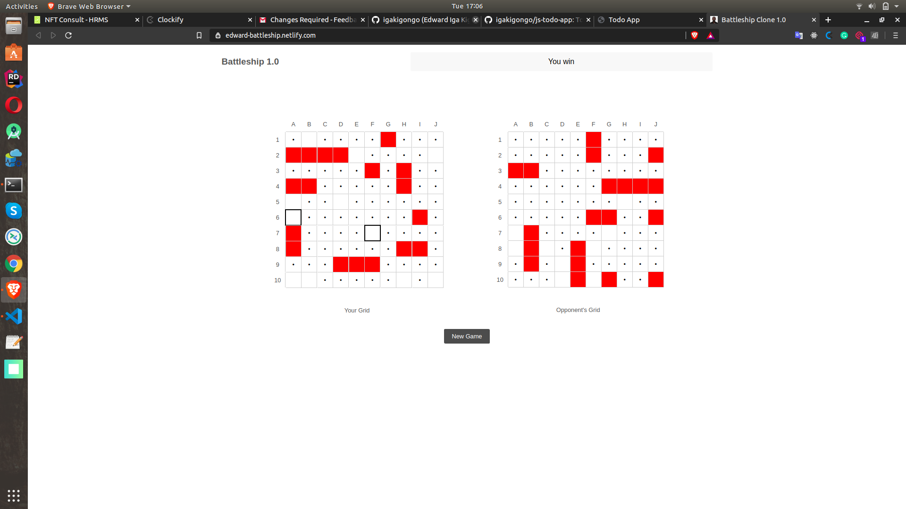

# Battleship Project

  The top level goal is to design the [battleship game](https://www.theodinproject.com/courses/javascript/lessons/battleship) using Test Driven Development.

  The main focus is to demonstrate developer's ability to 
  - Write `unit tests` in JavaScript
  - Use a test runner such as `jest` to achieve the above goal

  Summary of concepts that the developer should be familiar with at this point in time
  
  - Object Oriented Programming, 
  - Objects, 
  - Constructors, 
  - Factory Functions, 
  - The Module Pattern, 
  - ES6 Notation, 
  - Webpack and Testing with Jest.

## Features
  - The game involves a human player versing a computer player
  - Each player will set up ships on their board, upon finishing this the board is presented to the opponent
  - During games play, the human player cannot see the ships
  - The first to hit all ships on the opponent's board is presented as the winner

## Desirable Features
  - Allow 2 human players (remote/local) to play in the same game
  - Maintain a scoreboard for different sessions
  - Share scoreboards with friends on a social network
  - Persist scoreboard data in a remote database or local storage

## Getting Started

  - Clone this repository on your machine.
  - run `npm i` in the root directory to install all dependencies
  - run `npm test` in order for jest to run all unit tests and show test results

### Prerequisites

The software does not have any prerequisites, but in case you need to modify it, then the following software should be present on you machine

  * [NPM](https://nodejs.org/en/) node package manage
  * [Visual Studio Code](https://code.visualstudio.com/) or any other modern IDE of your choice as long as it supports editing `HTML/CSS/JS` files

### Installing and/or Running the game

For installation of the above listed software please visit their official websites for a quick start, since no custom settings are required. 

For dependencies refer to the getting started section

To run the game
  - Make sure you have installed all dependencies
  - Run this command `npm run serve` to open the game in the browser and start playing it

## Authors

* [**Edward Iga Kigongo**](github.com/igakigongo)

## License

The project and all associated source code are free for redistribution and modification.

## Demo 

### Live Link

For a live preview of the game please visit this [link](https://edward-battleship.netlify.com/).

### Screenshots

#### Human Player Wins Against The Computer
